# Atención en hospitales Covid-19 (Manual de Usuario)

## Introducción
Actualmente, el mundo está afrontando una pandemia del virus Covid-19 registrado por primera vez en diciembre de 2019 en Wuhan, China. El primer caso del virus en Guatemala fue el 13 de marzo del presente año y desde entonces se han tomado medidas preventivas para evitar contagio masivo. Sin embargo, al ser un muy contagioso es inevitable la propagación entre ciudadanos. 
Por lo tanto, se requiere de un sistema de salud eficiente que agilice la atención a contagiados y sospechosos para contener la propagación. Además, al ser un virus muy contagioso, es importante estar preparados e informados de los recursos hospitalarios que se tienen a disposición de los ciudadanos guatemaltecos. 
Debido a esta situación, como estudiantes de segundo año de Ingeniería en Informática y Sistemas de la Universidad Rafael Landívar, se nos solicitó el desarrollo de una aplicación que conecte la información entre hospitales destinados a la cura y detención del virus, agilice la disponibilidad de camillas y lleve una estadística de la cantidad de pacientes, ya sea sospechosos o contagiados, que se han registrado generalmente y por hospital. 

## Requerimientos
### Funcionales 
* Se debe poder realizar un registro de los pacientes. 
* El paciente deberá ser atendido en el hospital más cercano. 
* Los pacientes confirmados y los sospechosos deben ser atendidos por aparte. 
* Los pacientes deben ser asignados a una cola de espera específica basado en su ubicación, fecha y hora de ingreso. 
* Los pacientes confirmados serán asignados a una camilla. 
* Los pacientes sospechosos deberán pasar por una prueba para verificar si se descarta su caso o se re asigna su caso a contagiados. 
* El sistema debe realizar una simulación del resultado de la prueba y de la asignación de camas. 

### No Funcionales
* La data de cada paciente debe mantenerse almacenada en una estructura de árbol AVL
* Para ordenar los pacientes se les debe asignar en estructuras de colas de prioridad. 
* Las camas deben estar manejadas con una estructura de HashTable por hospital. 
* Se deberá realizar un repositorio en git para manejar el control de versionado. 

## Funcionamiento 

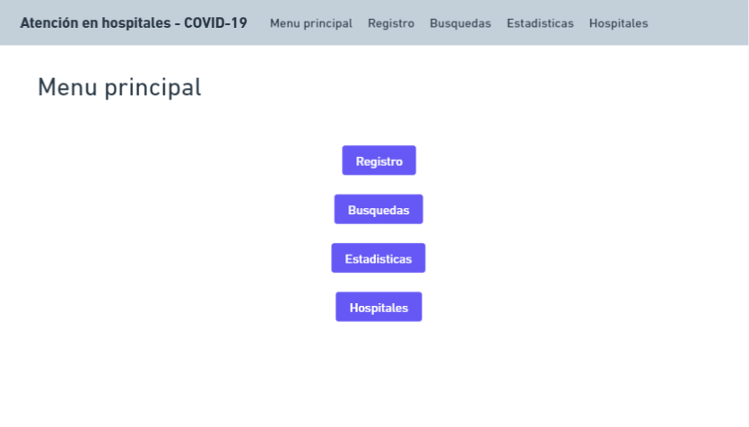

 **Menú principal:** Es la página principal del programa, en esta vista se encuentran las secciones disponibles. Cada una lo llevarán a un menú secundario con diferentes opciones.  

### 1.	Registro  

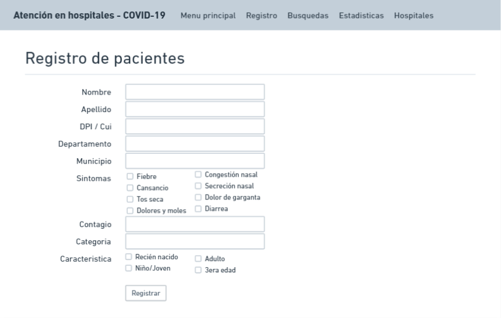

En esta sección el usuario podrá ingresar los datos del paciente. Se le solicita el nombre, apellido, DPI o Cui (dependiendo de la edad del paciente), departamento de residencia, municipio, síntomas que presenta, la posible causa de contagio, 

categoría del paciente (sospechoso o confirmado) y la característica (el rango de edad al que pertenece). 

Esta información se almacenará en la base de datos del programa para llevar registro de los ingresados. Adicionalmente, se enviará a los pacientes a una cola dependiendo de la categoría y se le asignará camilla a las personas contagiadas si estuvieran disponibles. 

En el apartado de departamento y municipio se ingresa en el que fue registrado el paciente, esto para garantizar que se le envíe al hospital más cercano a su ubicación actual y no a la procedencia de su dpi. 

### 2.	Búsquedas

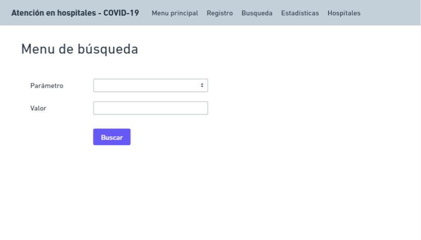

El presionar el botón de "Búsquedas" se desplegará una vista en la que podrá seleccionar el parámetro por el que quiere buscar a un pacientes (Nombre, apellido o DPI/Cui) y además deberá ingresar el valor buscado. Al pulsar Buscar, el programa le mostrará las coincidencias de búsqueda en el siguiente formato: 

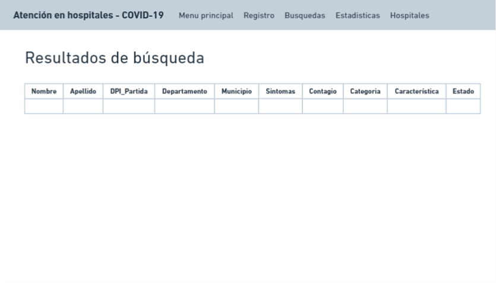

En esta tabla se le mostrará toda la información ingresada en el Registro de pacientes y también el estado en el que se encuentra el paciente actualmente. Podrá observar pacientes en estado "contagiado", "sospechoso" y/o "recuperado".

### 3.	Estadísticas 

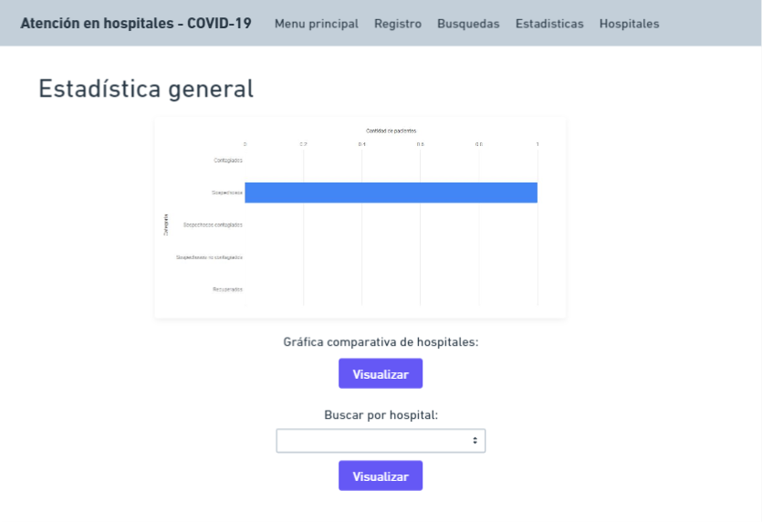

En esta pestaña, el usuario observará la gráfica general de datos de ingreso y egreso de pacientes. Se muestran los datos de las personas contagiadas, sospechosas y recuperadas que han ingresado al sistema de hospitales. La cantidad de sospechosos es la suma de sospechosos contagiados y no contagiados, y los pacientes se suman a cada una de las categorías dependiendo de los resultados del examen. 

En este espacio podrá encontrar dos funcionalidades extra: 
**a)	Gráfica comparativa de hospitales**
	Esta gráfica compara la cantidad de pacientes contagiados, sospechosos y 	egresados que hay en cada hospital. Se muestran los cinco hospitales en la 	misma gráfica. 
	
**b)	Buscar por hospital **
	En este separado puede seleccionar un hospital en específico del que se 	quieran ver los datos listados anteriormente, se mostrará una gráfica similar a la general, pero con los datos de un solo hospital (el 	seleccionado).

GraficaComparacionHospitales
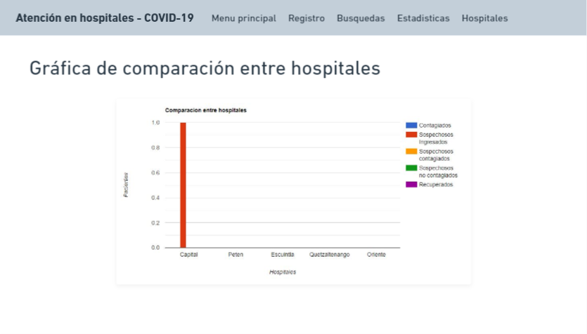

**Vista de gráfica comparativa de hospitales**

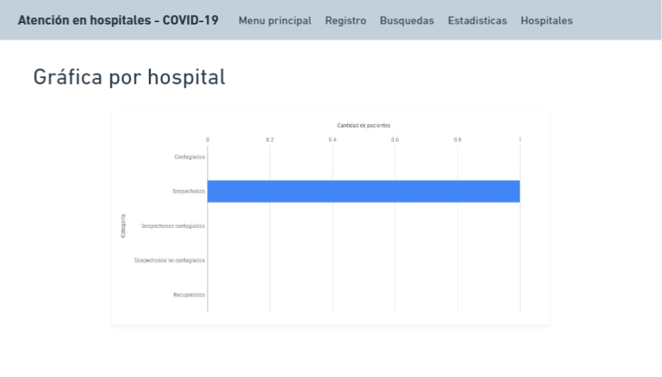

### 4.	Hospitales

Al seleccionar esta opción, el programa le desplegará un menú de hospitales donde se encuentran los cinco disponibles y cada hospital mostrará tres opciones:

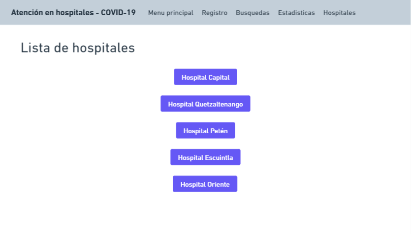

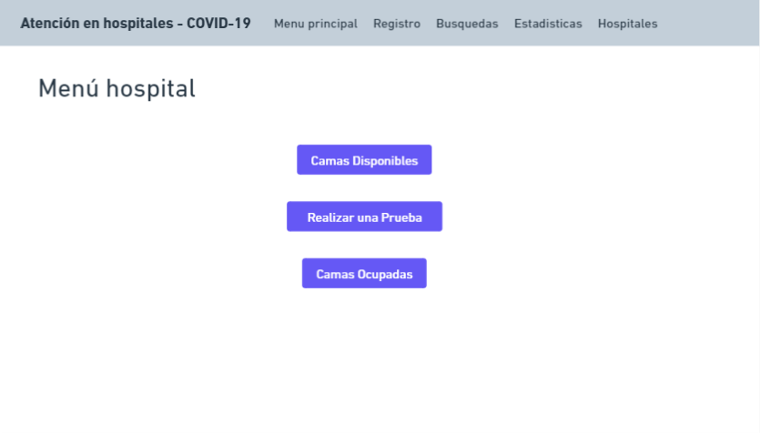

**a)	Camas disponibles y ocupadas**
Se muestra una tabla con las camillas que se encuentras ocupadas por un paciente y las que están disponibles, así como el código y el número de 	camilla en el hospital.

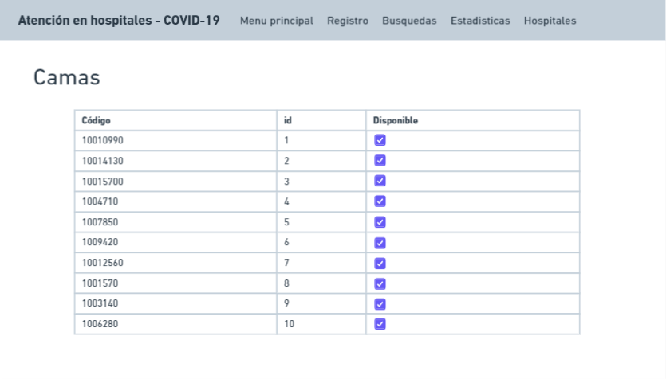

**b)	Realizar una prueba **
Al realizar una prueba, el programa analiza la probabilidad que tiene un 	paciente de estar contagiado y muestra el resultado de la prueba, para 	luego enviarlo a la cola de contagiados (o camilla si hubiera una 	disponible) o descartarlo. 

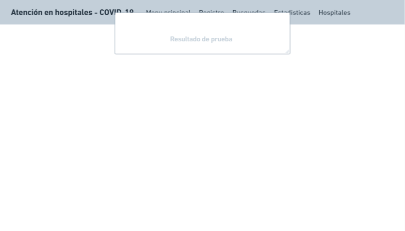

Los mensajes que pueden mostrar la aplicación son: 

* •	El paciente que era sospechoso y seguía en la cola ha resultado positivo para el Covid - 19
* •	La prueba ha salido negativa
* •	No se puede realizar la prueba, no hay sospechosos en la cola.

Como usuario puede navegar entra las diferentes secciones principales del programa en la parte superior presionando la funcionalidad a la que se quiere dirigir.

